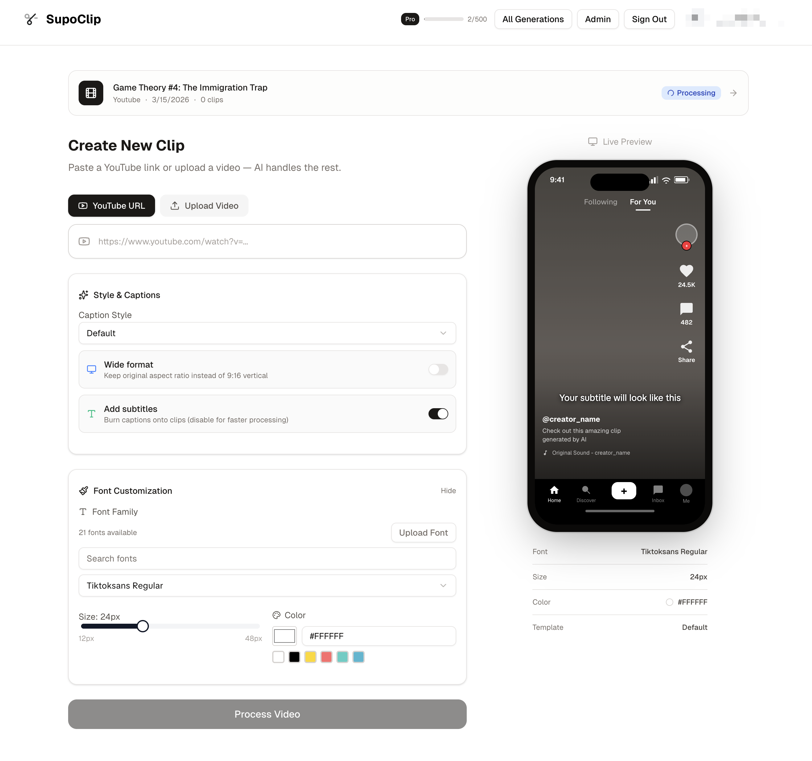

<p align="center">
  <a href="https://www.supoclip.com">
    
  </a>
</p>

<h3 align="center">Fuck OpusClip.</h3>

<p align="center">
  ... because good video clips shouldn't come with ugly watermarks or platform lock-in.
</p>

<p align="center">
  <a href="LICENSE"></a>
  <a href="https://www.supoclip.com"></a>
  <a href="docs/README.md"></a>
</p>

<p align="center">
  <a href="https://apps.apple.com/us/app/supoclip/id6784760040">
    
  </a>
</p>

---

SupoClip is an open-source, AI-powered video clipping tool. Give it a long video — a podcast, a talk, a stream VOD — and it finds the most viral-worthy moments, scores them, and renders them as vertical 9:16 clips with face-centered cropping, word-synced subtitles, hook titles, and optional B-roll. Run it yourself, customize it, inspect it — or use the hosted version and skip the setup.

## Ways to Use SupoClip

| | |
|---|---|
| **Hosted web app** | [www.supoclip.com](https://www.supoclip.com) — no infrastructure to run |
| **iOS app** | [SupoClip on the App Store](https://apps.apple.com/us/app/supoclip/id6784760040) — the same hosted pipeline, from your iPhone |
| **Self-host** | Docker Compose setup below — AGPL-3.0, unlimited usage on your own hardware |
| **MCP server** | [`mcp/`](mcp/) — use SupoClip from Claude, Cursor, and other MCP clients |
| **REST API** | API keys from `/settings/api-keys` authenticate the backend directly — see the [API reference](docs/api-reference.md) |

## Why SupoClip Exists

OpusClip is genuinely good at what it does — AI clip selection, accurate captions, virality scoring. But your usage is metered by plan, some exports carry platform branding, and your content and workflows live on their servers under their terms.

SupoClip gives you the same core pipeline without the leash:

- **Self-hostable** — run it on your own hardware, process as much as it can handle
- **No watermarks** — your content stays yours
- **Open source** — AGPL-3.0, full transparency, fork and extend it however you like
- **Hosted option** — when you'd rather not manage servers, the cloud version is there

## Features

- **AI clip selection** — an LLM (Azure OpenAI, or a local Ollama model) picks the 3–7 most clip-worthy segments from the transcript
- **Virality scoring** — every clip gets hook, engagement, value, and shareability scores
- **Smart vertical cropping** — face detection keeps the speaker centered in the 9:16 frame
- **Word-synced subtitles** — AssemblyAI word-level timestamps, custom fonts, caption templates with animation styles
- **Hook titles** — an AI-written headline burned into the top of each clip's opening seconds
- **B-roll & transitions** — optional Pexels stock footage overlays and transition effects
- **Built-in editor** — trim, split, and merge clips, then export with platform presets (TikTok, Reels, Shorts)
- **Real-time progress** — live pipeline updates streamed to the browser while your video processes

## Quick Start

You need Docker, an [AssemblyAI](https://www.assemblyai.com/) API key for transcription, and Azure OpenAI credentials for clip analysis.

```bash
git clone https://github.com/FujiwaraChoki/supoclip.git
cd supoclip
```

Create a `.env` in the root with your keys:

```env
ASSEMBLY_AI_API_KEY=your_assemblyai_api_key
LLM=azure-openai:gpt-4.1-mini
AZURE_OPENAI_API_KEY=your_azure_openai_api_key
AZURE_OPENAI_ENDPOINT=https://<your-resource>.openai.azure.com
AZURE_OPENAI_API_VERSION=2025-04-01-preview
AZURE_OPENAI_DEPLOYMENT=your-deployment-name
```

Then start everything:

```bash
docker-compose up -d
```

First startup takes a few minutes; watch it with `docker-compose logs -f`. Once healthy, open [http://localhost:3000](http://localhost:3000), create an account, and start clipping. The backend API lives at [http://localhost:8000](http://localhost:8000) with interactive docs at `/docs`.

To use a different LLM provider, self-host with Ollama, or configure the optional pieces (B-roll, analytics, emails, YouTube metadata), see the [configuration guide](docs/configuration.md). If something misbehaves, the [troubleshooting guide](docs/troubleshooting.md) covers the common failure modes.

## Documentation

Everything beyond this page lives in [`docs/`](docs/README.md):

| Guide | What it covers |
|---|---|
| [Setup](docs/setup.md) | Docker-first install, local development, first-run checklist |
| [Configuration](docs/configuration.md) | Every environment variable, operating modes, provider options |
| [App Guide](docs/app-guide.md) | Screens, workflows, admin features, hosted vs self-host |
| [Architecture](docs/architecture.md) | How the frontend, API, worker, queue, and pipeline fit together |
| [API Reference](docs/api-reference.md) | Backend endpoints, API keys, admin and billing routes |
| [Development](docs/development.md) | Running locally without Docker, testing, contributing workflow |
| [Troubleshooting](docs/troubleshooting.md) | Fixes for the common ways things go wrong |

## Development & Testing

The stack runs locally without Docker too — see [development](docs/development.md) for the backend (`uv` + FastAPI + ARQ worker) and frontend (Next.js + pnpm) commands. The test suite spans pytest, Vitest, and Playwright, all reachable from the repo root:

```bash
make test
```

## License

SupoClip is released under the [AGPL-3.0 License](LICENSE).

Contributions are accepted under the terms in [CONTRIBUTING.md](CONTRIBUTING.md), including a license grant that allows the project owner to sublicense and relicense contributed code.
